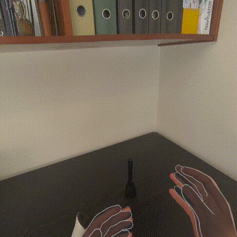
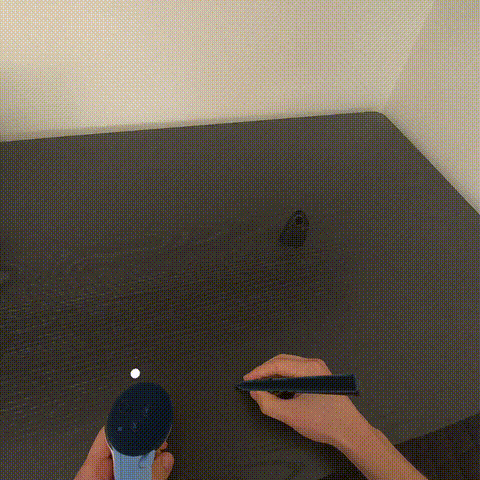

# MX Ink Exploration
A comprehensive exploration of Logitech MX Ink stylus integration across multiple platforms and frameworks for XR applications.

<table width="100%">
  <tr>
    <td width="33.33%" align="center">
      
      <b>Hand + Controller + Stylus Detection</b>
    </td>
    <td width="33.33%" align="center">
      
      <b>Trigger Pressure Sensitive Spatial Drawing</b>
    </td>
    <td width="33.33%" align="center">
      
      <b>Tip Pressure Sensitive Surface Drawing</b>
    </td>
  </tr>
</table>

## Overview

This repository contains multiple demos showcasing the Logitech MX Ink stylus integration with different technologies for creating interactive 3D drawing experiences in virtual and mixed reality. Each demo demonstrates different approaches to stylus input handling, 3D rendering, and platform integration.

## Projects

### Web-Based Demos

#### [A-Frame Demo](Web/Aframe/)
A WebXR demo using A-Frame framework for AR applications. Features real-time 3D stroke rendering with custom stroke geometry and MX Ink controller integration.

#### [Three.js Demo](Web/Threejs/)
A WebXR demo using Three.js for VR/MR applications. Utilizes TubePainter for creating 3D tube-like strokes with MX Ink stylus integration.

### Unity Demos

#### [Unity OpenXR Demo](Unity/OpenXR/MXInkExploration_OpenXR/)
A Unity demo using OpenXR for Meta Quest passthrough applications. Features real-time line drawing with pressure sensitivity and haptic feedback.

#### [Unity MetaXR Demo](Unity/MetaXR/MXInkExploration_MetaXR/)
A Unity demo using Meta's XR SDK for Quest applications. Provides alternative integration approach using Meta's native XR framework.

## Common Features

All demos share these core capabilities:
- **MX Ink Stylus Integration**: Full support for tip pressure, front/middle/back buttons
- **3D Drawing**: Real-time stroke creation and rendering
- **Controller Support**: Left and right-handed operation
- **XR Integration**: Support for VR/AR headsets and passthrough modes

## Hardware Requirements

- **Logitech MX Ink Stylus**: Primary input device for all demos
- **XR Headset**: Meta Quest 3/3S or other WebXR/OpenXR compatible device
- **Development Setup**: Varies by project (see individual READMEs)

## Technology Stack

- **Web**: A-Frame, Three.js, WebXR Device API
- **Unity**: Unity 6000.0 LTS+, OpenXR / MetaXR Plugins, XR Interaction Toolkit
- **Build Tools**: Vite (web), Unity Build System
- **XR Standards**: WebXR, OpenXR, Meta XR SDK

## Credits

This work builds on top of:
- [Logitech](https://logitech.github.io/mxink/UnityIntegration.html)'s mxink documentation for [Unity](https://unity.com/)
- [Diego Marcos](https://github.com/dmarcos)'s mx-ink-controls native integration for [A-Frame](https://github.com/aframevr/aframe)
- [Fabio Cortés](https://github.com/fcor)'s mx-ink-webxr template for [Three.js](https://threejs.org/)

For further information, please contact me at fsnap@protonmail.com.
